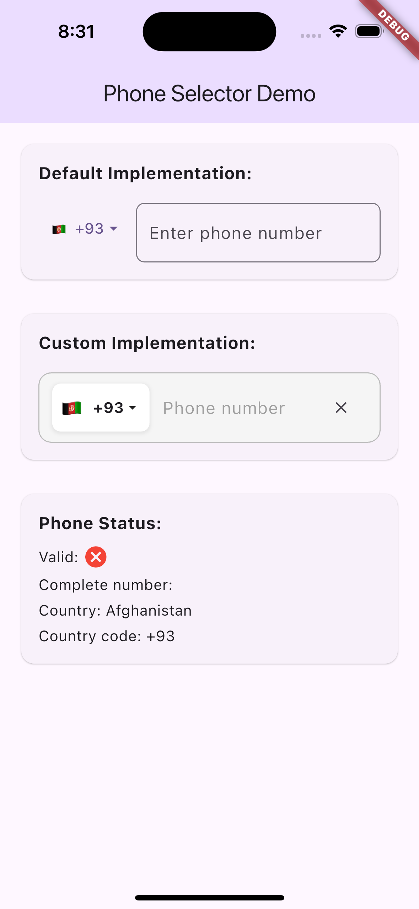
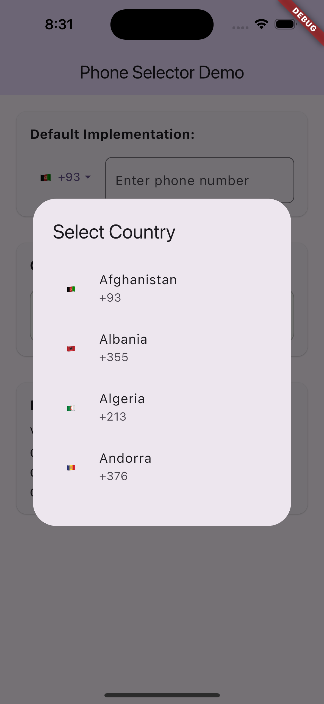
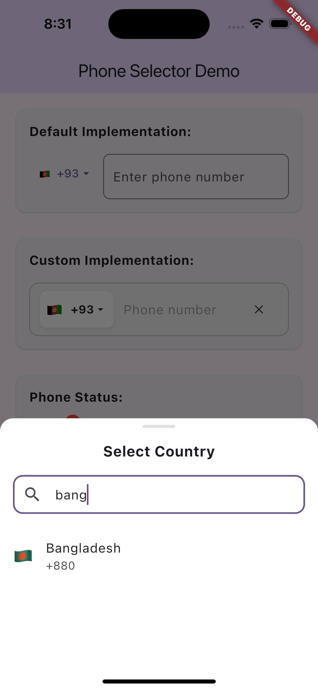

# intl_phone_selector

A highly customizable international phone number selector for Flutter applications. This package
provides the core functionality for international phone number input fields while giving developers
complete freedom to customize the UI according to their design requirements.

[](https://pub.dev/packages/intl_phone_selector)
[](https://opensource.org/licenses/MIT)

## Features

- 🌐 Support for international phone numbers with country codes
- 🎨 Highly customizable UI components
- ✅ Built-in validation for different country formats
- 📱 Automatic formatting based on country standards
- 🔄 Country selection with search functionality
- 🚀 Minimal dependencies
- 🛠️ Simple and intuitive API

## Screenshots

<div style="display: flex; gap: 10px;">
  
  
  
</div>

## Installation

Add this to your package's `pubspec.yaml` file:

```yaml
dependencies:
  intl_phone_selector: ^0.0.1
```

Then run:

```bash
flutter pub get
```

## Usage

### Basic Implementation

```dart
import 'package:flutter/material.dart';
import 'package:intl_phone_selector/intl_phone_selector.dart';

class PhoneInputExample extends StatefulWidget {
  @override
  _PhoneInputExampleState createState() => _PhoneInputExampleState();
}

class _PhoneInputExampleState extends State<PhoneInputExample> {
  late PhoneNumberController _controller;
  bool _isValid = false;

  @override
  void initState() {
    super.initState();
    _controller = PhoneNumberController();
  }

  @override
  void dispose() {
    _controller.dispose();
    super.dispose();
  }

  @override
  Widget build(BuildContext context) {
    return Scaffold(
      appBar: AppBar(title: Text('Phone Input')),
      body: Padding(
        padding: const EdgeInsets.all(16.0),
        child: Column(
          children: [
            BasicPhoneInput(
              controller: _controller,
              onValidationChanged: (isValid) {
                setState(() {
                  _isValid = isValid;
                });
              },
              decoration: InputDecoration(
                hintText: "Enter phone number",
                border: OutlineInputBorder(),
              ),
            ),
            SizedBox(height: 16),
            Text('Valid: $_isValid'),
            SizedBox(height: 8),
            Text('Number: ${_controller.completeNumber}'),
          ],
        ),
      ),
    );
  }
}
```

### Custom Implementation

The real power of this package is that you can fully customize the UI while still using the core
functionality:

```dart
Widget _buildCustomPhoneInput() {
  return Container(
    decoration: BoxDecoration(
      borderRadius: BorderRadius.circular(12),
      color: Colors.grey.shade100,
      border: Border.all(color: Colors.grey.shade400),
    ),
    padding: const EdgeInsets.symmetric(horizontal: 12, vertical: 8),
    child: Row(
      children: [
        // Custom country selector
        InkWell(
          onTap: () async {
            final country = await showYourCustomCountryPicker(context);
            if (country != null) {
              _controller.setCountry(country);
            }
          },
          child: Container(
            padding: const EdgeInsets.all(8),
            decoration: BoxDecoration(
              color: Colors.white,
              borderRadius: BorderRadius.circular(8),
            ),
            child: Row(
              children: [
                Text(_controller.selectedCountry.flagEmoji),
                SizedBox(width: 4),
                Text(_controller.selectedCountry.dialCode),
                Icon(Icons.arrow_drop_down, size: 16),
              ],
            ),
          ),
        ),

        SizedBox(width: 12),

        // Custom phone field
        Expanded(
          child: TextField(
            controller: _controller.numberController,
            decoration: InputDecoration(
              border: InputBorder.none,
              hintText: 'Phone number',
            ),
            keyboardType: TextInputType.phone,
            onChanged: (_) {
              _controller.formatPhoneNumber();
            },
          ),
        ),
      ],
    ),
  );
}
```

## Package Components

### PhoneNumberController

The core controller class that manages phone number input, country selection, and validation.

```dart

final controller = PhoneNumberController();

// Get the complete phone number with country code
String completeNumber = controller.completeNumber;

// Check if the number is valid
bool isValid = controller.isValid();

// Change country
controller.setCountry
(
newCountry);

// Don't forget to dispose
@override
void dispose() {
controller.dispose();
super.dispose();
}
```

### Country

A model class that represents country data with dial code and flag.

```dart

Country myCountry = Country(
  name: 'United States',
  code: 'US',
  dialCode: '+1',
  flagEmoji: '🇺🇸',
);
```

### BasicPhoneInput

A ready-to-use phone input widget that provides basic functionality.

```dart
BasicPhoneInput
(
controller: controller,
decoration: InputDecoration(
hintText: 'Enter phone number',
border: OutlineInputBorder(),
),
onValidationChanged: (isValid) {
// Handle validation changes
},
onNumberChanged: (number) {
// Handle number changes
},
onCountryChanged: (country) {
// Handle country changes
},
)
```

### CountriesData

A utility class containing country data and helper methods.

```dart
// Get a list of all countries
List<Country> allCountries = CountriesData.allCountries;

// Find a country by code
Country us = CountriesData.getCountryByCode('US');

// Find a country by dial code
Country india = CountriesData.getCountryByDialCode('+91');
```

## Customization Options

### Phone Number Formatting

The package automatically formats phone numbers based on the selected country's standards. You can
customize this behavior by modifying the `PhoneNumberFormatter` class:

```dart
class MyCustomFormatter extends PhoneNumberFormatter {
  @override
  String format(String text, String countryCode) {
    // Your custom formatting logic
    return formattedText;
  }
}
```

### Country Picker

You can implement your own country picker UI while still using the package's data:

```dart
Future<void> _showCountryPicker() async {
  final selectedCountry = await showModalBottomSheet<Country>(
    context: context,
    builder: (context) {
      return YourCustomCountryPicker(
        countries: CountriesData.allCountries,
        onCountrySelected: (country) {
          Navigator.pop(context, country);
        },
      );
    },
  );

  if (selectedCountry != null) {
    _controller.setCountry(selectedCountry);
  }
}
```

## Adding Your Own Countries

You can extend the country data with your own countries:

```dart
// Add your custom countries
List<Country> myCustomCountries = [
  ...CountriesData.allCountries,
  Country(
    name: 'My Country',
    code: 'MC',
    dialCode: '+999',
    flagEmoji: '🏳️',
  ),
];
```

## Complete Example

For a complete example with custom UI, country picker, and validation, see
the [example app](example/lib/main.dart).

## Contribution

Contributions are welcome! If you find a bug or want a feature, please open an issue or submit a PR.

## License

This project is licensed under the MIT License - see the [LICENSE](LICENSE) file for details.
